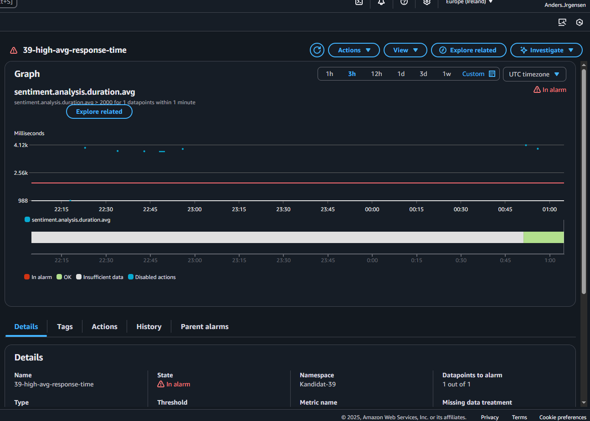
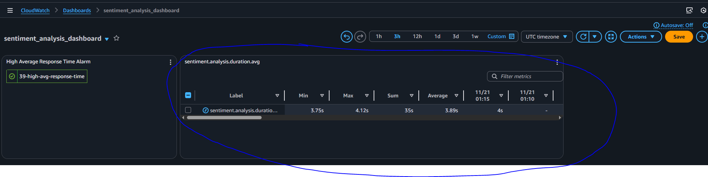

Leveranser \
**Oppgave 1**: workflow - https://github.com/AndersJorgensen04/pg301-exam-2025/blob/oppgave1/.github/workflows/terraform-s3.yml \

**Opgave 2 - Del A**:  \
    - Http endpoint for lambda funksjonen: https://4hxekc4aud.execute-api.eu-west-1.amazonaws.com/Prod/analyze/ \
    - Path til et lagret analyseresultat: https://eu-west-1.console.aws.amazon.com/s3/object/kandidat-39-data?region=eu-west-1&prefix=midlertidig/comprehend-20251118-163037-d5f28591.json \
**Oppgave 2 - Del B**: \
    - SAM-workflow fil: https://github.com/AndersJorgensen04/pg301-exam-2025/blob/main/.github/workflows/sam-deploy.yml \
    - Succesful deploy: https://github.com/AndersJorgensen04/pg301-exam-2025/actions/runs/19482182277/job/55756081873 \
    - Successful PR validation: https://github.com/AndersJorgensen04/pg301-exam-2025/actions/runs/19482173196/job/55756051566 \
    - For å få workflow til å kjøre må du:  \
        - Sette opp AWS credentials i github secrets \
        - Gjøre en pull request med endringer under sam-comprehend/ mappen \
        - Merge PR til main for å kjøre deploy \

**Oppgave 3 - Del A**: \
    - link to dockerfile: https://github.com/AndersJorgensen04/pg301-exam-2025/blob/main/sentiment-docker/dockerfile \

**Oppgave 3 - Del B**: \
    - Link til .github/workflow/docker-build.yml: https://github.com/AndersJorgensen04/pg301-exam-2025/blob/main/.github/workflows/docker-build.yml \
    - Link til 'successful' build: https://github.com/AndersJorgensen04/pg301-exam-2025/actions/runs/19514823076/job/55863779523 \
    - Forklaring på strategi: Jeg valgte å bruke sha-tagging strategi for å kunne garantere unike tagger for versjonene, ingen forandringer slik som kan oppstå av å bruke 'latest' taggen. Med denne strategien kan også taggen bli brukt for å finne tilbake til commiten som var gjort for den versjonen av builden. \
    - Navn på  Container image: andinijor/pg301-exam:sha-0284a4cc3541e3686756b9a17f33501f258adf5e \
    - Hvordan teste workflowen: \
        1. Etter å ha forket repository mitt, Sørg for å lage en Docker Hub Access token https://hub.docker.com/signup \
        2. Gå til Settings -> Secrets and variables -> Actions -> New repository secret, og legg til "DOCKER_USERNAME" med ditt brukernavn og "DOCKERHUB_TOKEN" med token du lagde.\
        3. gjør en liten endring under mappen sentiment-docker (f.eks legg til en tom linje), commit og så push til main
        4. Se workflow i action :) \
        5. Sjekk Docker Hub repository "navn/pg301-exam, da skal du kunne se den nye tagget sha-"832y941233323fg243234184"- lignende \

**Oppgave 4 - Del A**: \
    - Screen shot av cloudwatch metrics-konsoll :  \
    - Forklaring:  \  
    Jeg valgte å implementere DistribuitionSummary og  Timer som metrikkinstrumenter. Timer valgte jeg får å kunne se hvor for eksempel se hvor lang tid på gjennomsnitt et 'company' bruker på å bli behnadlet. \
    DistribuitionSummary er fint for å måle numeriske verdier for analyse, et godt eksempel er å se på confidence scores for hver enkelt selskap på snitt, og ut i fra det kan man vite om selskape har hatt gode eller vonde perioder. \  

**Oppgave 4 - Del B**: \
    - Jeg har laget en alarm som sjekker averag tid på response hos et spesefikt selskap, i dette tilfelle ville jeg holde øye med "Apple", det er fult mulig å gjøre dette med andre bedrifter også. det er bare å lage flere alarmer. Alarmen går når average response tid er over 2000 millisekunder. Dette kan gi praktisk informasjon om hvordan applikasjonen blir brukt. I dette tilfelle la jeg til en sleep funksjon i SentimentController.java, grunnet at det er vanskelig å trigge en slik alarm uten å gjøre en fake sleep for å øke response tiden. I produksjon ville man selvfølgelig ikke brukt det. I praksis kan en slik alarm gi informasjon om at analyser som handler om apple er flere eller generelt større og tar lengere tid og prossesere. \
    Jeg brukte en terraform.tfvars fil for å sette email_name til min email.
    - Screenshot av email notification:  \
    - Screenshot av alarm i dashboard:  \
    - Screenshot av dashboard med metrikk eksempel:  \

**Oppgave 5**: \
    På veldig kort tid har KI-assistenter som ChatGpt og Claude fått stor betydning for utviklere. Disse KI-assistentene kan gjøre skrive kode og foreslå gode ideer om design. I det siste har det vært mye snakk om hva fremtiden vil se ut som med slike verktøy, er det for godt til å være sant?
\
\
    DevOps prinsippet Flow handler om å tide fra utviklingen til produksjon, målet er ofte å gjøre små endringer ofte, og det gjelder hele veien fra utviklingen og helt til endringene er ute i produksjon. Det er derfor gode pipelines er så viktig. KI kan hjelpe til med å skrive kode som er ønsket, og flere utviklere bruker det i hverdagen sin. og det er sant at KI-assistentene kan skrive god kode, som fungerer og kanskje til og med er optimal. Det virker også som at disse assistente blir bedre for hver eneste dag som går, og det er vanskelig å si hvor grensa går på hvor effektive de kan bli. De virker allerede brukbare for det meste, men de gjør forsatt feil. 
    \
    \
    Feedback prinsippet handler om å oppdage feil tidlig, samtidig få kontinuerlig tilbakemeldinger fra tester, overvåkninger og brukerfeedbacks. Hvis man skal ta i bruk KI-assistent i feedback-loopen er det viktig å ha fullstendige PR reviews. Det kan være småe detaljer som har blitt oversett og da er det fint å ha noen med dypere forståelse for hele prosjektet til å se over hva som faktisk foregår. Mange bruker også KI til å lære, hvis noe gikk galt under testene eller lignende kan man som regel få en god begrunnelse fra KI som beskriver hvorfor noe gikk galt. Så lenge personer også prøver å ta til seg informasjonen og lære av feilen, istedenfor å bare bruke KI for å løse problemet der og da, fordi det kan føre til at utvikleren kan bli sløvere med sin egen vurdering.
\
\
    Hvis en utvikler ønsker å lære nye språk eller rammeverk kan KI-assistenter være ekstremt effektive får å lære det bort, men da er det viktig at utvikleren også prøver å lære. Hvis man bruker KI-assistenter for å generer kode får et språk man ikke har mye kompetanse med, kan det fort bli til at personen forsetter å prøve helt til noe fungerer, uten å faktisk prøve å lære seg grunnen til hvorfor det gikk galt i først omgang.
    Å kunne få disse servert på noen sekunder er veldig kjekt, og skaper definitivt en god flow med hyppige leveranser, men samtidig er det viktig å være kritisk til hva som blir laget, det kan inneholde huller, eller unødvendig kompleksitet som skaper mer forvirring for deg selv og andre rundt. 
    \
\
    DevOps prinsipper kan forsatt vedlikeholdes selv med bruk av KI-assistenter, men det krever at teamet er kritisk til hva som kan bli produsert. Hvis man ikke passer på å bruke hodet selv kan man glemme hvordan det er å jobbe på egen hånd. Det er viktig å se på KI-assistentene som verktøy som kan hjelpe deg, men kanskje ikke løse alt for deg.

